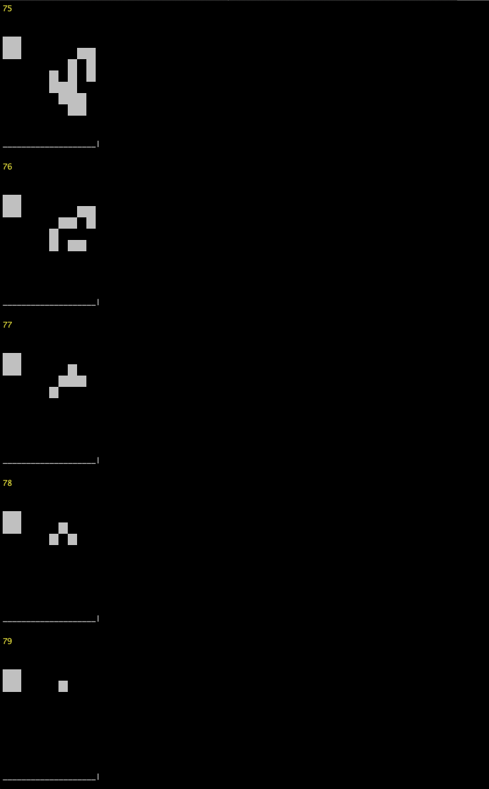

# Conway's from the Terminal

Ever wanted to see the original Cellular Automata in action, all from the safety of iTerm? Now you can. Presenting a simple, one page node implementation of Conway's Game of Life. Start with a grid of random noise, and run until it either stabilizes or 1000 generations pass; whichever comes first!

### How to Use

Simply clone this repository locally, enter `node gol.js`, and watch out.

